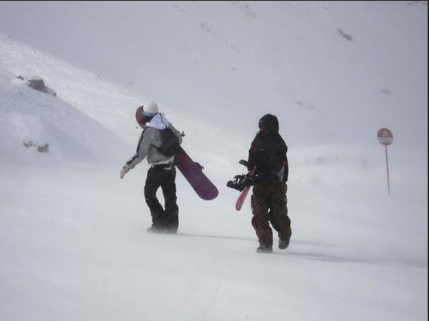

# color

<table>
    <tr>
        <td >
图1  范冰冰 
</td>
        <td >
图2 范冰冰
</td>
        <td>
图3 高圆圆
</td>
        <td >
图4 高圆圆
 </td>
        <td >
图1  范冰冰 
</td>
        <td >
图2 范冰冰
</td>
        <td>
图3 高圆圆
</td>
        <td >
图4 高圆圆
 </td>
        <td>
图3 高圆圆
</td>
        <td >
图4 高圆圆
 </td>
    </tr>

    <tr>

    </tr>
</table>

# shape

# texture
